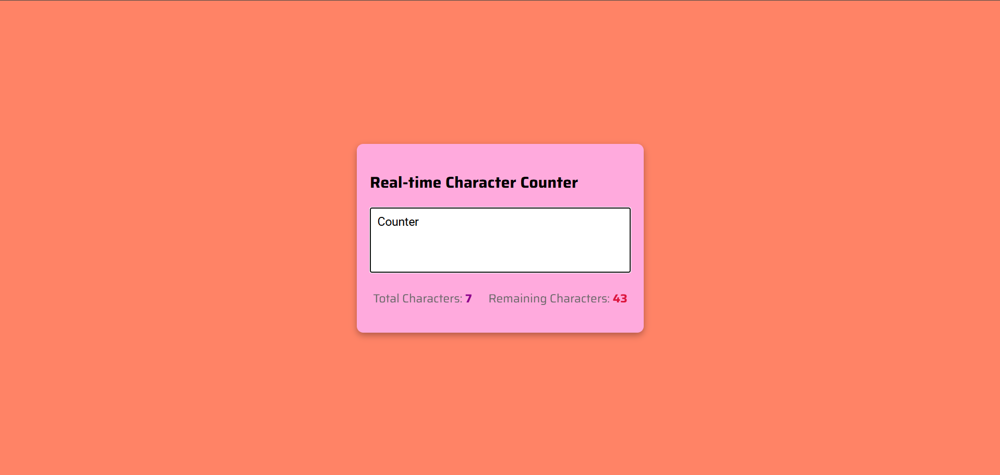

# 🔢 Real-time Character Counter

A lightweight, responsive web app that counts characters in real time as you type — with a live total and remaining character display.


---

## ✨ Features

- **Live character tracking** — updates instantly on every keystroke
- **Total characters used** — displayed prominently as you type
- **Remaining characters** — counts down from the max limit (50)
- **Max length enforcement** — textarea restricts input beyond the limit
- **Clean, responsive UI** — centered card layout with Google Fonts styling

---

## 📸 Preview



---

## 🚀 Getting Started

No build tools or dependencies required — just open and run.

### 1. Clone the repository

```bash
git clone https://github.com/dyaus8/character-counter.git
cd character-counter
```

### 2. Open in browser

```bash
open index.html
```

Or simply double-click `index.html` in your file explorer.

---

## 📁 Project Structure

```
character-counter/
├── index.html   # App markup and layout
├── style.css    # Styling and Google Fonts
├── app.js       # Counter logic
└── icon.png     # Favicon
```

---

## 🛠️ How It Works

The counter logic lives entirely in `app.js`:

```js
textar.addEventListener("keyup", () => {
    updateCounter()
})

function updateCounter() {
    totalCounter.innerText = textar.value.length
    remainingCounter.innerText = textar.getAttribute("maxlength") - textar.value.length
}
```

On every `keyup` event, it reads the textarea's current length and the `maxlength` attribute to compute and display both counters.

---

## 🎨 Customization

| What | Where | How |
|---|---|---|
| Character limit | `index.html` | Change `maxlength="50"` on the `<textarea>` |
| Colors | `style.css` | Edit `background-color`, `.total-counter`, `.remaining-counter` |
| Font | `style.css` | Swap the Google Fonts `@import` URL |
| Textarea size | `style.css` | Adjust `.textar` `height` and `font-size` |

---

